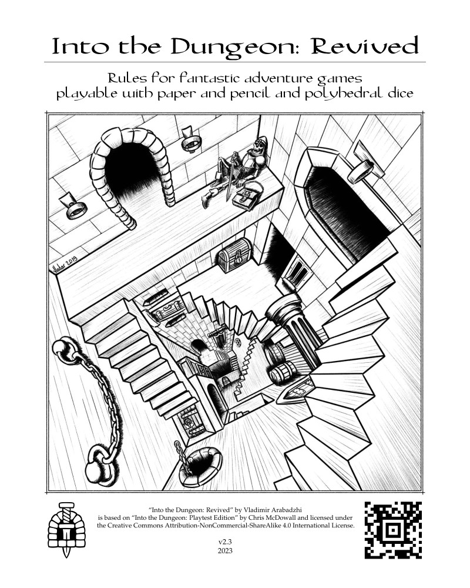
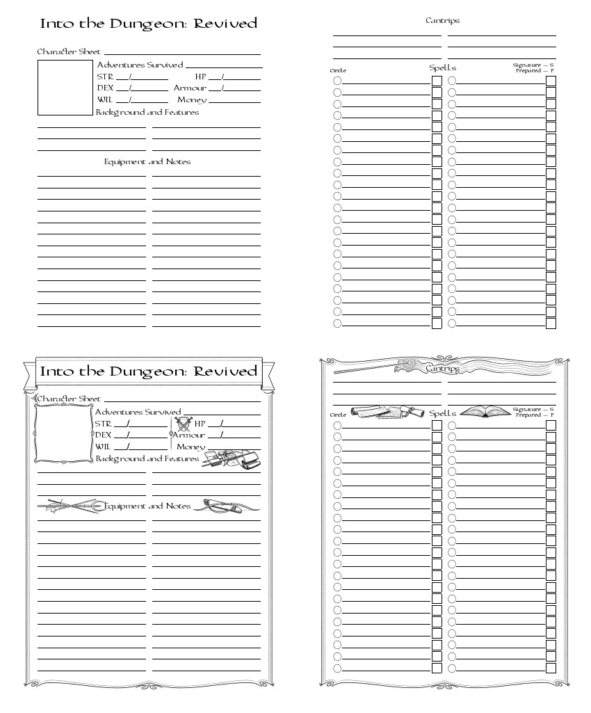

Into the Dungeon: Revived
=========================

*Rules for fantastic adventure games playable with paper and pencil and polyhedral dice*

ItD:R is a lightweight fantasy-themed role-playing ruleset designed for a streamlined gameplay. Gather your friends, grab some dice, and dive into the world of sword and sorcery adventures of your own creation!

In this book you will find:
* Easy to learn rules, core ones fit on a one-page spread
* Quick character generation and feature-based levelling
* Fast combat thanks to the absence of to-hit rolls
* Basic domain rules for upper-level games
* A magic system with easy-to-remember spell effects
* Simple game mechanics that allow to minimize session preparation time
* A guide for converting monsters from other systems
* A collection of additional and alternative rules to mix and match for the perfect gaming experience
* Random inspiration tables to use for preparation or even during sessions
* A small bestiary with different monsters and wild animals

The ruleset is based on ["Into the Dungeon: Playtest Edition"](https://docs.google.com/file/d/0B6MR1KWIUR9UVVNjeUtvSDZTMUk) by [Chris McDowall](http://www.bastionland.com/).

### [Home Page](https://vladar4.github.io/itdr/)

### [Latest Release](https://github.com/Vladar4/itdr/releases/latest)

### [itch.io](https://vladar.itch.io/into-the-dungeon-revived)

### Illustration gallery at [ArtStation](https://vladar.artstation.com/projects/zAmRZQ) and [DeviantArt](https://www.deviantart.com/vladar4/gallery/68893105/into-the-dungeon-revived)

  
Character sheets preview

  

PDFs
----
All PDFs are located in the "current" directory.

| PDF file | Description |
|---|---|
| itdr.pdf   | current version of the book |
| itdr_light\*.pdf | light edition (28 pages): parts_1-4, part_a1, part_index |
| itdr_minimal\*.pdf | minimal edition (16 pages): parts_1-4 only |
| \*_booklet.pdf   | booklets for printing   |
| \*_booklet_r.pdf | booklets for printing with odd pages rotated upside down |
| itdr_charsheet.pdf | character sheet |
| itdr_charsheet_double\*.pdf | double character sheets for printing |
| itdr_timesheet.pdf | time-tracking sheet |
| itdr_timesheet_double\*.pdf | double time-tracking sheets for printing |

Printing
--------
* Page setup:
  * for `*_booklet.pdf`: Two-sided - short edge (flip)
  * for `*_booklet_r.pdf`: Two-sided - long edge (standard)
* Page scaling: `none`
* Auto rotate and center: `yes`
* Trim printed booklets to about 5.4in x 8in.

Scripts
-------
| Script                         | Description                                                                                                               |
|--------------------------------|---------------------------------------------------------------------------------------------------------------------------|
| cleanup.sh                     | clean auxiliary files                                                                                                     |
| make_all.sh                    | update ALL PDFs in the repository                                                                                         |
| make_booklet.sh [-r] [FILE]... | make specified booklets, "-r" key to rotate odd pages upside down (see in-script options and comments for more info) |
| make_booklets.sh               | make all booklets (default, light, and minimal) including ones with upside down odd pages (with suffix "_r")              |
| make_charsheets.sh             | make all charsheet versions                                                                                               |

Dependencies
------------
[TeX Live](https://www.tug.org/texlive/)

### Arch
`sudo pacman -S texlive-bin texlive-core texlive-fontsextra texlive-latexextra`

### Debian
`sudo apt-get install texlive-latex-base texlive-fonts-extra texlive-latex-extra`

What is different from "Into the Dungeon: Playtest Edition"?
------------------------------------------------------------

* Game mechanics are closer to "Into the Odd"
* Features and backgrounds instead of classes
* Updated and refined magic system
* Knowledge rolls
* Wands and rods usage rule
* Example magic items
* Example random encounters and obstacles
* Monster conversion guide
* Ideas for monster creation and example monster abilities
* Great amount of additional and alternative rules (Appendix A)
* Expanded bestiary (Appendix B)
* Spell List and Index

Changelog
---------

### v2.2

v2.2 changelog

#### Part 1
* Berserker: the effect now lasts till the end of the next turn

#### Part 2
* Mounted Combat: added a note on using two-handed weapons when mounted
* Added Restrained and Stunned Conditions

#### Part 4
* Added an exception for casting Cantrips in Armour
* Added a Spellburn term for taking Damage from casting Prepared Spells; instead of falling unconscious, become Stunned for the next turn
* Distances/Areas: added a default - if not specified, the Spell affects a single target that you can see in your vicinity
* Improved specific wording of the Spells
* Fixed alphabetical order of the Spells

##### Cantrips
* Detect Poison: touch range
* Hide: touch range
* Mending: touch range
* Resistance: touch range

##### Circle 1
* Camouflage: targets the area adjacent to you
* Cause Fear: lasts for the duration
* Chill Touch: targets living creatures
* Colour Spray: DEX Save instead of STR
* Enlarge/Reduce: touch range; removed Advantage/Disadvantage on STR Saves
* Erase: touch range
* Feather Fall: small sphere area
* Floating Disk: additional notes
* Hideous Laughter: targets a humanoid
* Identify: touch range
* Obscuring Mist: targets a small area around you
* Shield: targets you
* Sleep: targets living creatures

##### Circle 2
* Arcane Lock: touch range
* Continual Flame: touch range
* Heroism: targets a creature
* Invisibility: 'target' instead of a 'creature'
* Magic Mouth: touch range
* Magic Weapon: touch range
* Protection from Arrows: touch range
* Whispering Wind: targets a known recipient or a group

##### Circle 3
* Absorb Element: touch range
* Explosive Runes: must be inscribed; explode when read or touched
* Illusory Script: touch range
* Sepia Snake Sigil: must be inscribed
* Shrink Item: touch range
* Suggestion: the target must understand you
* Vampiric Touch: targets a living creature

##### Circle 4
* Cause Panic: lasts for the duration
* Fire Trap: targets an object or a door
* Remove Curse: touch range
* Symbol of Pain: must be inscribed

##### Circle 5
* Alter Fate: improved wording
* Break Enchantment: touch range
* Cloudkill: added a STR Save
* Contact Other Plane: d6 WIL Loss on a failed WIL Save
* Feeblemind: touch range
* Symbol of Sleep: must be inscribed

#### Part 5
* Changed Increasing/Decreasing Damage dice to Raising/Lowering Damage dice

#### Part 6
* Added a note on Magic Rings (one per hand)
* Added a note on Drawbacks and Curses

#### Part 8
* Monster Conversion: Changed HD=HP/8 to HD=HP/5 (an average of d8)

#### Appendix A
* Manufacture of Magic Equipment: changed 1 day to d4 days
* Construction: adjusted construction volumes and prices
* Travel: redid the Horizon paragraph
* Waterborne Travel: added a note on an insufficient crew impact on speed
* Weather: added Swimming and Holding Breath rules
* Random Magic Items: added new items into the Consumables table

#### Appendix B
* Snake Demon: 15hp instead of 18
* Added extra description to some monsters

#### Miscellaneous
* Wording and layout improvements
* Typo fixes

#### Home Page
* Tools: added the Horizon and Visibility calculator
* Improved layout

### v2.1

v2.1 changelog

#### Part 1
* Beastmaster may choose to make a WIL Save instead of the pet
* Thaumaturge starts with two Gifts instead of one
* Improved starting equipment description

#### Part 2
* Taking your Turn: clarified sequence

#### Part 3
* Ruling a Domain: Unrest roll is changed from "equal or lower" to "lower"

#### Part 4
* Simultaneous Persistent Spells are limited to 2 x Mystic Level
* Dispel:
  * Superiority in the Mystic Level grants Advantage
  * Added a rule for dispelling Persistent Spells
##### Circle 1
* Identify: improved description
##### Circle 3
* Invisibility Sphere: improved description
##### Circle 5
* Perfect Weapon: now Persistent; does not disappear when casting spells.

#### Part 5
* Combat Turn Sequence: expanded into Marching Order and Combat Turn Sequence

#### Part 7
* Random Encounters: A note on using larger dice

#### Part 8
* Monster Conversion: Improved Morale conversion table

#### Appendix A
* Characters:
  * Added the Balanced Characters rule
  * Added Fortune Favours the Brave rule
* Added the Group Saves rule
* Selling: Added chance of the barter rule
* Travel:
  * Exhaustion Check
  * Simplified Speed Modifiers
  * Added units of measure in the horizon formula
  * Added a note regarding weather duration
  * Added the Movement in Combat and Exploration section
* Random Characters: fixed and improved
* Random Magic Items:
  * 'dust' entry changed to 'dust or powder'
  * Added the colour table reference
* Random Monsters: updated, added an instruction and a new table - Material
* Random Non-Player Characters: 'red hair' entry changed to 'rare hair colour'

#### Miscellaneous
* Improved document style and layout
* Improved booklet script and printing layout

#### Home Page
* Tools:
  * Random Character
  * Random Non-Player Character
  * Random Monster
  * Random Magic Item
  * Random Weather
* Improved layout, implemented responsive design

### v2.0

v2.0 changelog

#### Part 1
* Berserker: "gain Advantage on Saves against Critical Damage" now reads "gain Advantage on **subsequent** Saves against Critical Damage"
* new Feature: Beastmaster
* Brawler: added missing "Can be taken multiple times" line.
* new Feature: Duellist
* new Feature: Ironclad
* Mystic: added optional rule of Random Spell Selection
* new Feature: Sharpshooter
* new Feature: Thaumaturge
* new Background: Hunter
* new Background: Labouter
* additions into the Equipment section:
  - Lance
  - Acid

#### Part 2
* Ganging Up: Clarification on attacks that directly target Ability Scores
* Enhancement/Impairment: note on mutual negation
* Armour: Clarification on attacks that bypass HP
* Rest: note on what may prohibit Resting
* new Pets rule (one per character)
* Experience Levels:
  - at least one lowest Ability Score will increase by one on level-up
  - Clarification for the Master Experience Level
  - alternative gold-based experience progression

#### Part 3
* Overall refinement
* Conscription Domain Focus
* Additional rules for training soldiers
* Damage bonus range is from -5 to +5
* Damage bonus is mentioned when units attack the individuals
* Individual attacks that cause Blast Damage are Impaired against Units as well
* Unit attacks that cause Blast Damage against units have bonus weapon Damage die.

#### Part 4
* Clarification of ongoing effects for summoned extraplanar creatures
* Optional Magic Mishap on a failed WIL Save from casting a spell
* Optional Scroll Activation rule
##### Cantrips
* Detect Magic: clarified wording
* Light is now Light/Douse
* Mage Hand is renamed into Magic Hand
* Message and Ventriloquism are merged into Ghost Sound
* Prestidigitation: usage is expanded
* Removed Open/Close as covered by Magic Hand
##### Circle 1
* new spell Camouflage
* new spell Courage
* new spell Glue
* Disguise Self: specified facial appearance
* Gust of Wind is moved here from the Circle 2
* Pyrotechnics is moved here from the Circle 2; usage is expanded
* Swarm is moved here from the Circle 2
##### Circle 2
* Acid Arrow: now STR Loss is d4 and affected by Armour
* Arcane Sight is moved here from Circle 3
* Cat's Grace: now affects ranged weapon Damage
* Gentle Repose is replaced with new spell Speak with Dead
* Glitterdust: clarified wording
* Heroism: can target others, saves are rerolled on 20, works once until Rest (per target)
* Hex: new spell
* Knock: rephrased
* Magic Mouth: now speaks once or each time when triggered
* Magic Weapon is moved here from the Circle 1
* Misdirection: removed (see Obfuscate (C3))
* Rage is moved here from the Circle 3
* Ray of Enfeeblement is moved here from Circle 1
* Resist Element: now grants Impaired damage instead of immunity
* Rope Trick: now accommodates six creatures instead of eight
* Shatter: specified area of effect, now affects all targets, objects or crystalline creatures take d12 Damage
##### Circle 3
* new spell Absorb Element (old version of Resist Element)
* Black Tentacles: updated save mechanics
* Clairaudience/Clairvoyance: clarified effect
* Daylight: clarification regarding magical darkness
* Gaseous Form: now Persistent, added clarification regarding ending the effect
* Haste/Slow: now grants Advantage/Disadvantage on DEX Saves
* Magic Circle: fits one creature
* Obfuscate: new spell combines Misdirection and Nondetection
* See Invisibility is moved here from the Circle 2
* Shrink Item: works only on non-magical objects
* Stinking Cloud: specified area of effect and clarified repeated saves
* Suggestion: added a note on saves against harmful suggestions
* Water Breathing: clarified wording
* Wind Wall: clarified wording
##### Circle 4
* Animate Dead: added a note on control
* Arcane Eye: you can cast Cantrips through it
* Confusion: specified area of effect
* Dimensional Anchor: specified area
* Fear is renamed into Cause Panic
* Fire Shield: clarified wording
* Nightmare: changed "full rest" to "full night's sleep"
* Polymorph: added limitations
* Rainbow Pattern: specified affected targets and what happens after passing a Save
##### Circle 5
* new spell Alter Fate
* Blight: specified living targets
* new spell Bloody Gossamer
* new spell Disintegrate
* Dominate Person: added a note on repeated Saves
* new spell Hermit's Company
* Passwall: specified duration
* Possession is replaced with Mass Suggestion
* Mage's Faithful Hound is renamed into Mystic's Faithful Hound, will follow the caster, now Persistent
* False vision is merged into Mage's Private Sanctum which is renamed into Mystic's Private Sanctum and now Persistent
* new spell Mystic's Saving Grace
* new spell Perfect Weapon
* new spell Permutation
* Telekinesis: added a note on damage
* Telepathic Bond: added note on presence of targets, now Persistent

#### Part 5
* A note on combat turn sequence
* A note on attack notation
* A note on Ability Score Loss rolls

#### Part 6
* A note on magic items drawbacks
* Poison is changed to Deadly Poison with new effects

#### Appendix A
* Contest rule
* Hardcore Mode rule
* Injuries: changed limb table
* Magic Mishaps: changed conditions and body part table
* Rations: added cost
* Selling rule
* Siege Engines: added reload and transportation rules
* Travel: clarified rules, vehicle overload penalty, and cargo space occupied by short-distance passengers
* Units of Measure: added coin weights

#### Appendix B
* Gazer: Disintegration beam now deals d6 Damage ignoring Armour
* Ghoul: new monster
* Hook Horror: changed d10 Hooks to 2d8 Hooks
* Hootbear: changed d10 Claws to 2d8 Claws
* Phase Panther: changed d8 Clawed Tentacles to 2d8 Clawed Tentacles
* Red Dragon: changed d10 Claws to 2d10 Claws
* Elephant: Changed 2d8 Tusks to d10 Tusks

#### Appendix C
* Removed

#### Style
* New and updated illustrations
* References, style, layout, formatting, and alignment update
* Index update
* Removed Notes part
* Timesheet

### v1.2.1

v1.2.1 changelog

* light and minimal editions of the book
* character sheets
* new building scripts
#### Part 1
* fixed and updated Halfling Ancestry Feature
#### Part 4
* 2nd Circle:
  * Owl's Wisdom: now grants Advantage on WIL Saves
* 3rd Circle:
  * Displacement: now Persistent
#### Other
* Mule and Horse rebalance
* Miscellaneous rules clarifications

### v1.2

v1.2 changelog

#### Part 1
* Berserker: a bonus is limited to melee
* Commander: a command does not count as action
* Healer: starts with 5s worth of healing supplies
* Skilled: grants a pair of expertises instead of one
* A note on Shields requiring one hand to use
* Adventuring Gear list update
* Stats for a mule and horse
#### Part 2
* An item swap option for the Taking your Turn rule
* Ganging Up bonus is limited up to +5
* Mounted bonus is limited to melee and unmounted opponents
* Morale rule exemption for mindless or fearless opponents
* An optional slower experience progression rule
#### Part 3
* An expanded note on walls and sieges
#### Part 4
* A note on Cantrips and ongoing effects
* Better explanation of damage from casting spells
* A note on Scrolls
* Cantrips:
  * Guided Strike: gives a bonus weapon Damage die instead of Enhancing
  * Light: removed an option to cast onto a creature; now requires the caster to hold the target object
  * Resistance: now Persistent
* 1st Circle:
  * Burning Hands: does not ignore Armour but deals d6 Damage
  * Identify: added a note on hidden properties, curses, etc.
  * Mount: added a Damage effect
  * Silent image: is motionless
  * Unseen Servant: changed STR from 3 to 5
* 2nd Circle:
  * Continual Flame: added a note on casting on objects
  * Fog Cloud: added a note on ranged attacks Impairment
  * Gust of Wind: specified range
  * Levitate: added an aftereffect and note on heavy targets
  * Misdirection: now Persistent
  * Phantom Trap: now Persistent
  * Resist Energy: renamed to Resist Element
  * Rope Trick: clarified description
  * See Invisibility: specified range
* 3rd Circle:
  * Arcane Sight: improved description and effect
  * Gaseous Form: the target is a willing creature
  * Major Illusion: a note on disguise
  * Magic Circle: now Persitent; affects a certain type of unnatural beings
  * Sepia Snake Sigil: specified symbol size
  * Shrink Item: a note on weight
  * Sleet Storm: specified range
* 4th Circle:
  * Fire Trap: now Persistent
  * Ice Storm: replaced by a Chain Lightning spell
  * Minor Creation: now Persistent
  * Phantasmal Killer: attacks once before disappearing
  * Polymorph: specified permanence of the effect
  * Solid Fog: specified range
  * Symbol of Pain: specified symbol size
* 5th Circle:
  * Baleful Polymorth: specified permanence of the effect
  * Blight: now affects d12 targets
  * Cloudkill: specified size, speed, and living targets
  * Major Creation: now Persistent
  * Symbol of Sleep: specified size; now grants a WIL Save
* Minor phrasing fixes
#### Part 5
* A note on Damage dice
* A note on poison targets
#### Part 6
* 20 example magic items
#### Part 7
* Example Random Encounters tables
* Example Obstacles
#### Part 8
* Ideas for Monster Creation
* Example Monster Abilities
#### Appendix A renamed to C
#### new Appendix A:
* Characters:
  * Epic Characters
  * Mundane Characters
* Gods, Religion, and Disciples
* Injuries
* Light
* Living Expenses
* Load Capacity
* Madness
* Magic Mishaps
* Manufacture of Magic Equipment
* Pets' Experience
* Rations
* Resources
* Structures and Sieges:
  * Construction
  * Siege Engines
  * Structural Damage
* Travel
* Random Tables and Inspiration:
  * Random Characters
  * Random Magic Items
  * Random Monsters
  * Random Non-Player Characters
#### Example Monsters moved to Appendix B
#### new Appendix B:
* New monsters:
  * Hellhound
  * Imp
  * Manticore
  * Mummy
  * Ogre
  * Troll
  * Yeti
* Mundane Beasts section with 10 beasts
#### Spell List
* Added spell circle info

### v1.1

v1.1 changelog

* Mystic advancement: Spell Circle is limited by Mystic Level instead of Experience Level
* Mystic's Tome is required when preparing spells
* Damage from casting spells targets WIL instead of STR
* Signature spells can be cast without preparation
* Spells changes:
  * Charm Person: targets humanoids only
  * Magic Missile: d4 instead of d6 damage
  * Ray of Enfeeblement: lasts until Rest instead of Healing
  * Shield: now blocks Magic Missiles
  * False Life: now affects lost STR instead of HP
  * Spectral Hand: clarified usage
  * Flame Arrows: "bonus damage" instead of "extra damage"
  * Lightning Bolt: d8 instead of d10 damage
  * Nondetection: now Persistent
  * Shout: d8 instead of d10 damage
  * Charm Monster: renamed to Charm Creature, targets all creatures
  * Remove Curse: now target any magical Disadvantages or Impairments
* Note on elemental damage
* Improved and clarified phrasing
* Index update
* Box style update

### v1.0.1
Bugfix release: force PDF 1.4 for the Acrobat compatibility.

### v1.0
First official release.

### v0.9.4-beta
First public beta-release.

